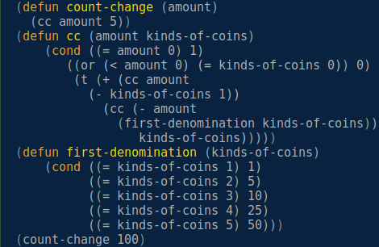
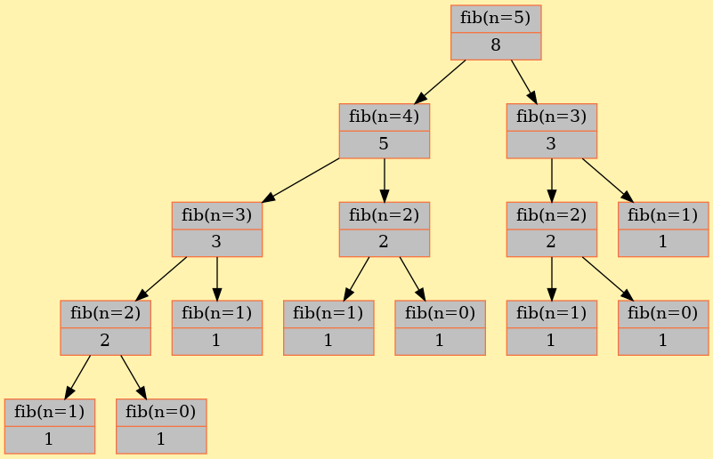
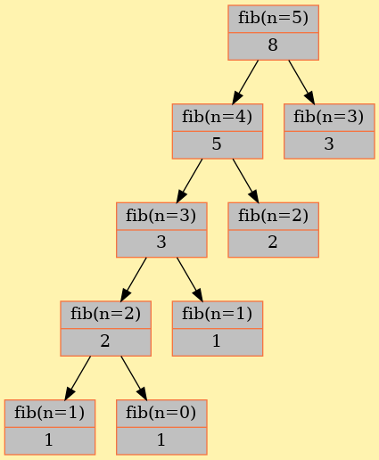

- [Что такое рекурсия?](#org4d61b66)
- [Правильная рекурсия](#org82e6859)
- [Что такое стек вызовов?](#orge75f0ca)
- [Что такое стек вызовов?](#org98fb3b0)
- [Почему рекурсия это плохо](#org428c926)
- [Recursion depth](#orgac68dea)
- [Глубина рекурсии](#orgb97da7b)
- [Почему рекурсия это хорошо](#org8ff1543)
- [Вариант задачи для рекурсии](#org9726a78)
- [решение на LISP](#org0dbb7c0)
- [трассирование](#org25a06d8)
- [Хвостовая рекурсия](#org21ab8b9)
- [Оптимизация хвостовой рекурсии и почему её нет в Python](#org940dc01)
- [Пример когда рекурсия помогает](#orgabb739d)
- [Динамическое программирование](#org4c069f8)
- [Кэширование](#orgba54923)
- [Поиск приблизительно совпадающих строк](#orgf604a3f)
- [Рекурсивное решение](#org9ed64d1)
- [Динамическое программирование в действии](#org55c254a)
- [Дополнительная литература](#org1f63359)
- [Вопросы-ответы](#orgee24d59)


<a id="org4d61b66"></a>

# Что такое рекурсия?

Приём в программировании, когда задача может быть разделена на несколько таких же, но проще, задач.  

```python
def pow(x, n):
    # возведение числа в степень это
    # умножение числа на число
    # в степени n-1
    if n == 0:
        return 1
    return x * pow(x, n-1)
```


<a id="org82e6859"></a>

# Правильная рекурсия

```python
def pow(x, n):
    # хорошо бы проверить,
    # что база достижима
    assert n >= 0
    # base case / база рекурсии
    if n == 0:
        return 1
    # recursive case / шаг рекурсии
    return x * pow(x, n-1)
```


<a id="orge75f0ca"></a>

# Что такое стек вызовов?

```python
def foo(msg):
    print '{} foo'.format(msg)

def main():
    msg = 'hello'
    foo(msg)

if __name__ == '__main__':
    main()
```


<a id="org98fb3b0"></a>

# Что такое стек вызовов?

  


<a id="org428c926"></a>

# Почему рекурсия это плохо

-   стек вызовов растёт вместе с ростом глубины рекурсии
-   можно попасть в бесконечную рекурсию и истратить всю память на стек вызовов


<a id="orgac68dea"></a>

# Recursion depth

```python
def inf_counter(x):
    print(x)
    return inf_counter(x+1)
f(0)
```


<a id="orgb97da7b"></a>

# Глубина рекурсии

```python
import sys

print(sys.getrecursionlimit())
sys.setrecursionlimit(
    sys.getrecursionlimit() + 234
)
print(sys.getrecursionlimit())
```

    1000
    1234


<a id="org8ff1543"></a>

# Почему рекурсия это хорошо

Помогает описать решение задачи понятным языком  

```python
# n! = n * (n-1)
def factorial(n):
    if n == 0:
        return 1
    return n * factorial(n-1)

print(factorial(5))
```

    120


<a id="org9726a78"></a>

# Вариант задачи для рекурсии

Попробуйте реализовать решение <span class="underline"><span class="underline">[этой задачи](https://github.com/pimiento/recursion_webinar/blob/master/count_change.py)</span></span> без использования рекурсии \Winkey[][green!60!white]  


<a id="org0dbb7c0"></a>

# решение на LISP

<span class="underline"><span class="underline">[count-change.lisp](https://gist.github.com/pimiento/05e2297358c65e2bf91eb71463747445)</span></span>  

  


<a id="org25a06d8"></a>

# трассирование

```python

def trace(f):
  indent = 0
  def g(*args, **kwargs):
    nonlocal indent
    print('|  ' * indent + '|--',
          f.__name__, *args, **kwargs)
    indent += 1
    value = f(*args, **kwargs)
    print('|  ' * indent + '|--',
          'return', repr(value))
    indent -= 1
    return value
  return g
cc = trace(cc)
count_change(10)
```


<a id="org21ab8b9"></a>

# Хвостовая рекурсия

Рекурсия, не требующая действий с возвращённым результатом из шага рекурсии.  

```python
def factorial(n, collected=1):
    if n == 0:
        return collected
    return factorial(n-1, collected*n)

print(factorial(5))
```

    120


<a id="org940dc01"></a>

# Оптимизация хвостовой рекурсии и почему её нет в Python

-   Интерпретаторы/компиляторы могут оптимизировать хвостовую рекурсию (Tail Call Optimization) и не делать записей в стек вызовов, а подменять переменные в стеке вызовов, таким образом код получится равнозначным обычному циклу
-   <span class="underline"><span class="underline">[Почему TCO нет и не будет в Python](https://neopythonic.blogspot.com/2009/04/final-words-on-tail-calls.html)</span></span>


<a id="orgabb739d"></a>

# Пример когда рекурсия помогает

-   **Задача:** У вас есть вложенная структура данных и вы хотите просуммировать значения поля X во всех объектах этой структуры.
-   **Решение задачи:** <https://github.com/pimiento/recursion_webinar/blob/master/recursion_example.py>


<a id="org4c069f8"></a>

# Динамическое программирование

```python

def fib(n):
    if n == 0:
        return 1
    if n == 1:
        return 1
    return fib(n=n-1) + fib(n=n-2)

```

  


<a id="orgba54923"></a>

# Кэширование

```python
cache = {0: 1, 1: 1}

def fib(n):
    if n not in cache:
        cache[n] = \
            fib(n=n-1) + fib(n=n-2)
    return cache[n]

```

  


<a id="orgf604a3f"></a>

# Поиск приблизительно совпадающих строк

Возможные действия над строками, каждое действие будет иметь стоимость $1$  

-   ***замена*:** заменить один символ в строку A1 на символ из строки A2. ("мама" → "рама")
-   ***вставка*:** вставить один символ в строку A1 так чтобы она совпала с подстрокой A2. ("роза" → "проза")
-   ***удаление*:** удалить один символ в строке A1 так чтобы она совпала с подстрокой A2. ("гроза" → "роза")


<a id="org9ed64d1"></a>

# Рекурсивное решение

```python
def lev(a: str, b: str) -> int:
    if not a: return len(b)
    if not b: return len(a)
    return min([
        lev(a[1:],b[1:])+(a[0]!=b[0]),
        lev(a[1:],b)+1,
        lev(a,b[1:])+1
    ])

print(lev("salt", "foobar"))
print(lev("halt", "salt"))
```

    - 6
    - 1


<a id="org55c254a"></a>

# Динамическое программирование в действии

```python
def levenshtein(
    a: str, b: str, m: List[List[int]]
) -> int:
  for i in range(1, len(a)):
    for j in range(1, len(b)):
      m[i][j] = min(
        m[i-1][j-1] + (a[i] != b[j]),
        m[i][j-1] + 1,
        m[i-1][j] + 1
      )
  return m[len(a)-1][len(b)-1]
```


<a id="org1f63359"></a>

# Дополнительная литература

-   [SICP](https://mitpress.mit.edu/sites/default/files/sicp/full-text/book/book.html)


<a id="orgee24d59"></a>

# Вопросы-ответы


